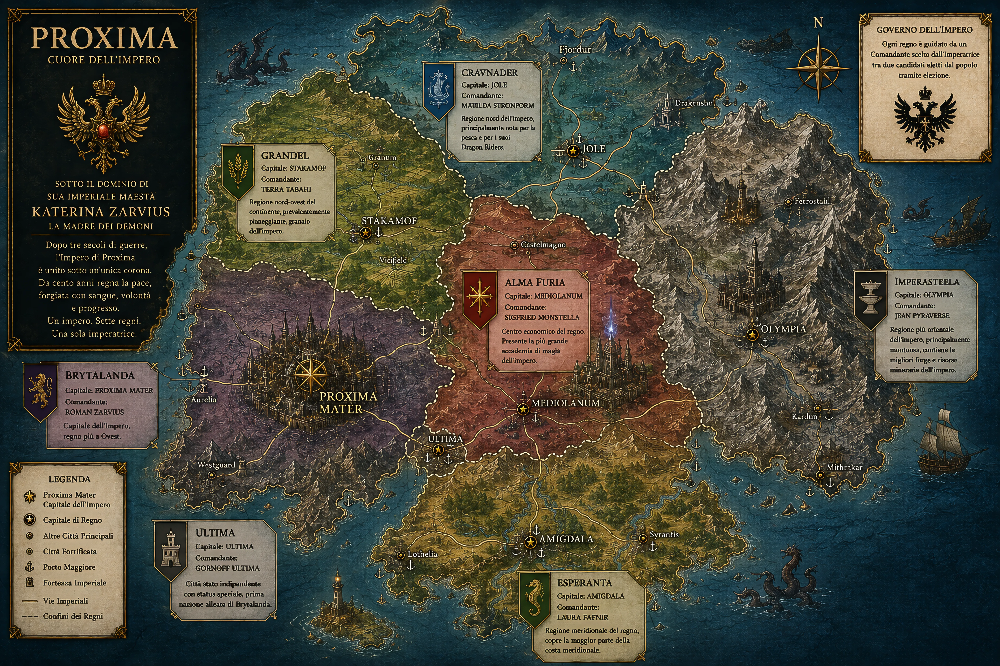

Proxima è un continente enorme, ricco e tecnologicamente avanzato.
Attualmente è gestita da un impero, a cui fa capo l'Imperatrice *Katerina Zarvius*, detta "La madre dei demoni".
Il continente era storicamente diviso in regni, assorbiti dall'impero, che originariamente era il regno di Brytalanda.
Dopo 300 anni di guerre, da 100 anni nel continente regna la pace.
L'imperatrice gestisce tutto quanto l'impero, mentre ogni ex-regno è sotto la giurisdizione di un Comandante, scelto dall'imperatrice tra due candidati eletti dal popolo tramite elezione.

| Regno | Capitale | Comandante | Descrizione |
| --------- | --------- | --------- | --------- |
| Brytalanda | Proxima Mater  | Roman Zarvius | Capitale dell'impero, regno più a Ovest |
| Alma Furia | Mediolanum | Sigfried Monstella | Centro economico del regno, Presente la più grande accademia di magia dell'impero |
| Esperanta   |  Amigdala | Laura Fafnir  | Regione meridionale del regno, copre la maggior parte della costa meridionale |
| Grandel | Stakamof | Terra Tabahi | Regione nord-ovest del continente, prevalentemente pianeggiante, granaio dell'impero|
| Imperasteela | Olympia | Jean Pyraverse | Regione più orientale dell'impero, principalmente montuosa, contiene le migliori forge e risorse minerarie dell'impero
| Cravnader | Jole | Matilda Stronform | Regione nord dell'impero, principalmente nota per la pesca e per i suoi Dragon Riders
Ultima | Ultima | Gornoff Ultima | Città stato al confine tra Brytalanda e Alma furia, gode di uno status di indipendenza speciale per esser stata la prima nazione alleata a Brytalanda

