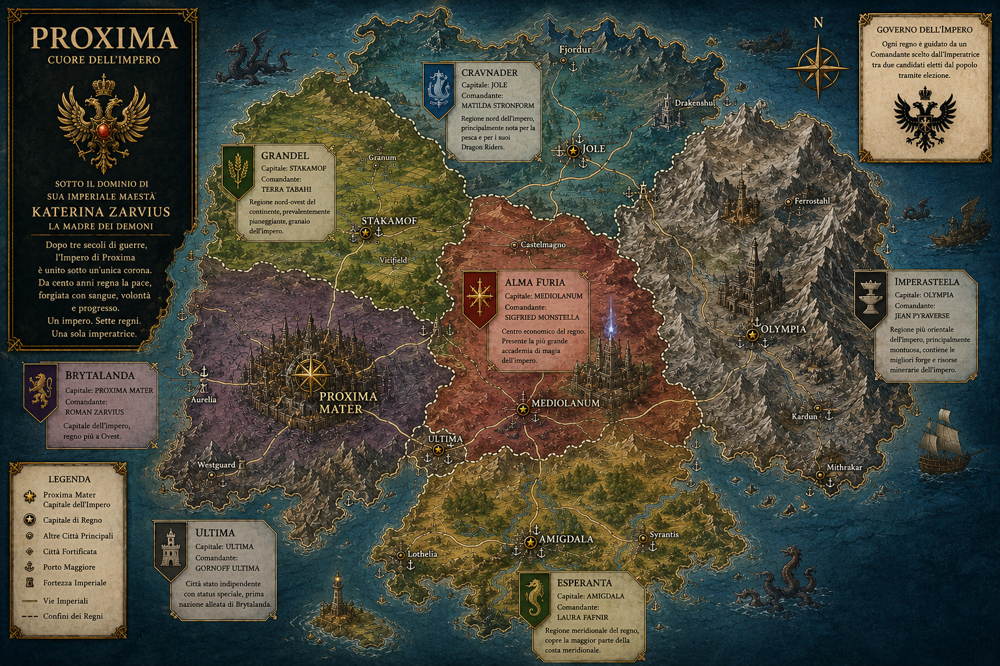

# Proxima

  <h1>PROXIMA</h1>

  <strong>Cuore dell'Impero</strong> 
  Un continente. Sette regni. Una sola Imperatrice.

---

> Dopo tre secoli di guerre, il continente di Proxima è stato unificato sotto una sola corona.  
> Da cento anni regna la pace, forgiata con sangue, volontà e progresso.
{: .quote-imperial }

## Esplora il mondo

### 🏛️ Impero

Struttura politica, regni, capitali e comandanti dell'Impero.

[Apri la pagina](lore/impero.md)

### ☀️ Pantheon

Gli dei riconosciuti dall'Impero: Nus, Azarith-Kai e le altre potenze divine.

[Apri la pagina](lore/pantheon.md)

### 🔥 Piaga del Fuoco

Una cronaca storica su uno degli eventi più inquietanti di Imperasteela.

[Apri la pagina](storia/piaga-del-fuoco.md)

## Lettura rapida per i giocatori

!!! note "Da sapere prima della campagna"
    Proxima è un impero stabile, ricco e tecnologicamente avanzato. La pace dura da un secolo, ma nessuna pace nata dopo trecento anni di guerra è davvero innocente. Sorpresa: la propaganda imperiale non ha inventato l'acqua calda, ma la sa vendere benissimo.
